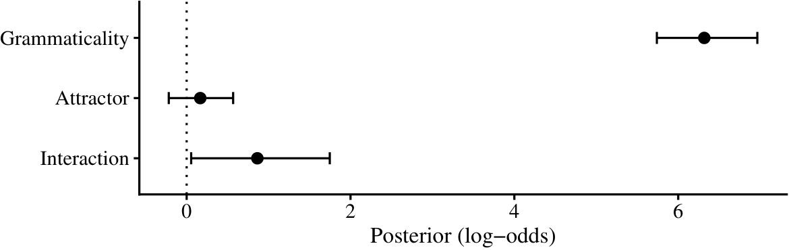
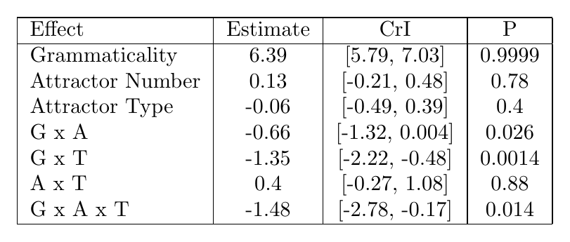
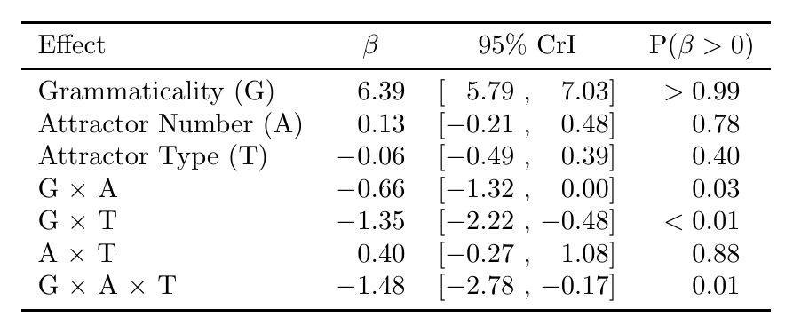
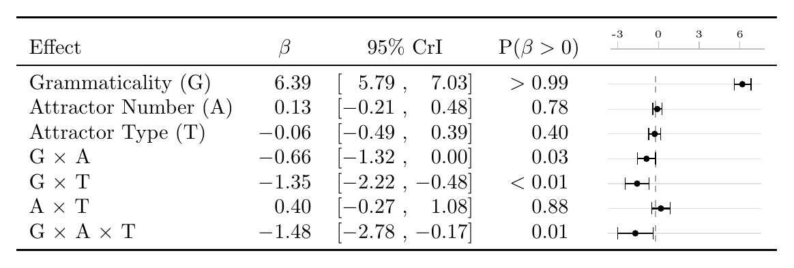

For me one of the most exciting parts of any writing is thinking about plots and what I can do differently. I have tried many things for descriptive plots that show means and stuff, but I never really experimented with the bayesian coefficient plots. While I was doing my MA, I started using my advisor's code for posterior distributions that do not show any abnormality, as below. It shows nice whiskers and is very easy to read. There is no unnecessary information. And sometimes, when I felt like simplifying that much was dishonest due to the shape of the distribution, I used the half-eye stats one.


{fig-alt="The plot style I used to use."}

However, I realized that some people really enjoy tables and want them. I do not understand them really. The information gained from a table is too detailed if you ask me, and one only needs that much information if they are doing a similar project. And if that is the case, one should just try to rerun their code. There is of course the thing that with old papers (and even some new ones in prestigious journals still) there is no code or even data. So, I will give them that.

However, I have to say, though some plots are horrendous, tables are almost always harder to read compared to a visualization. And sometimes, on top of that, they are ugly. When you scan a row like `-0.66 [-1.32, 0.00]`, you have to mentally place that interval on a scale, decide whether it crosses zero, and then compare it with the row above. Sometimes, you need to do this across multiple rows. Maybe some people have amazing working memory for this type of stuff, but to me it is almost impossible. One can of course use a table and a plot at the same time. But then it just cuts through so much text and is kind of an overkill.

So, I landed on a kind of compromise, inspired by gt tables. Why not put a whisker plot inside a table? This can easily be done with tikz; us linguists already work with tikz or forest way too much, and the syntax is not that complicated. I can show the posterior mean and 95% CrIs for each row as numbers and as a visualization.

We are going to build this step by step from an initial idea in latex, and then automate it with R. Here is our task list.

::: {.callout-tip}
## in a hurry?
If you just want the code and would rather figure it out yourself, everything in this post — the latex preamble and the R functions — is in [this github gist](https://gist.github.com/utkuturk/53a6b3c59cecbd3be5875086aa931d16).
:::

- Write the table everyone writes first
- Fix the alignment
- Add the whisker column
- Automate the whole thing from a `brmsfit` object

## The table everyone writes first

Let's be honest about where we all start. These days, one either goes to a latex table creator website, or uses their favorite AI, gives it the results, and makes it do a table. In either case, the results are dumped into a `tabular` environment like the following.

```latex
\begin{tabular}{|l|c|c|c|}
\hline
Effect & Estimate & CrI & P \\
\hline
Grammaticality & 6.39 & [5.79, 7.03] & 0.9999 \\
Attractor Number & 0.13 & [-0.21, 0.48] & 0.78 \\
Attractor Type & -0.06 & [-0.49, 0.39] & 0.4 \\
G x A & -0.66 & [-1.32, 0.004] & 0.026 \\
G x T & -1.35 & [-2.22, -0.48] & 0.0014 \\
A x T & 0.4 & [-0.27, 1.08] & 0.88 \\
G x A x T & -1.48 & [-2.78, -0.17] & 0.014 \\
\hline
\end{tabular}
```

{fig-alt="An ugly LaTeX table with vertical rules and unaligned numbers"}

Everything is technically there, yet it just looks so wrong. One can make it better and ask it to use an "APA" table.

- **Vertical rules and double `\hline`s.** The `booktabs` documentation has been begging us not to do this since 1995. If you want to have fun, read the `booktabs` documentation; it is short and it is angry.
- **Ragged decimals.** We have `0.4` next to `0.78`, which is also next to `0.9999`. The columns do not align, and your eye cannot compare magnitudes going down a column easily.
- **Hyphens as minus signs.** In text mode `-0.66` typesets a hyphen, which is shorter than a real minus and slightly off-center. Once you see it, you cannot unsee it. Sorry.
- **Mixed precision in P.** `0.9999`, `0.026`, and `0.4` suggest four, three, and one digits of certainty about a posterior probability. Though it is probably just because 0.4 is 0.4000, it still requires so much additional work from the reader.


## Alignment

Three small tools actually fix most of the problems I mentioned above, and none of them require anything beyond what one already uses when writing latex.

First, `booktabs` (`\toprule`, `\midrule`, `\bottomrule`) replaces the rules. Second, every number gets a fixed number of decimals and a proper math-mode minus, `$-$0.66`. Third — and I think this is the most important trick of this section — negative and positive numbers are aligned with a *phantom* text. Similarly, the greater-than and smaller-than parts are also aligned.

```latex
\newcommand{\pz}{\phantom{$-$}}   % invisible minus sign
\newcommand{\pr}{\mathrel{\phantom{>}}} % invisible > for the P column
```

If you have not met `\phantom` before: it typesets nothing, but takes up exactly the space of its argument. So `\pz6.39` is `6.39` pushed right by the width of a minus sign, and it lines up perfectly under `$-$0.66`. The same idea rescues the P column, where some rows read `$>0.99$` and others just `0.78`: prefixing the bare numbers with `\pr` (a phantom `>` with relation spacing) keeps the digits in one column.

And the last thing I do is that, inside the interval column, I put a `~` before the comma, which gives the lower bound a fixed right edge, so the commas stack vertically down the column. I find it easier to read.

```latex
\begin{tabular}{lccc}
  \toprule
  Effect & $\beta$ & 95\% CrI & P($\beta > 0$) \\
  \midrule
  Grammaticality (G)      & \pz6.39 & [\pz5.79~, \pz7.03] & $>0.99$    \\
  Attractor Number (A)    & \pz0.13 & [$-$0.21~, \pz0.48] & $\pr 0.78$ \\
  Attractor Type (T)      & $-$0.06 & [$-$0.49~, \pz0.39] & $\pr 0.40$ \\
  G $\times$ A            & $-$0.66 & [$-$1.32~, \pz0.00] & $\pr 0.03$ \\
  G $\times$ T            & $-$1.35 & [$-$2.22~, $-$0.48] & $<0.01$    \\
  A $\times$ T            & \pz0.40 & [$-$0.27~, \pz1.08] & $\pr 0.88$ \\
  G $\times$ A $\times$ T & $-$1.48 & [$-$2.78~, $-$0.17] & $\pr 0.01$ \\
  \bottomrule
\end{tabular}
```

{fig-alt="The same table with booktabs rules and aligned columns"}

Doesn't it just look better right now? To be honest, if you just stop here, it already looks better compared to many published tables. But the reader still has to simulate a number line in their head and place the intervals in that space for comparison, which was the whole complaint we started with.

## The whisker column

The core idea is to draw a tiny `tikzpicture` containing one horizontal CrI segment, two end parts of the error bar, a dot at the mean, and a vertical line at zero. When you think about it, the main plot I used to use contained nothing more than this. And then our column head is going to be our x-axis; we just have to make sure this is on a scale that is shared across all rows, and not carried over from one table to another. One important thing is that we will use `\renewcommand{}` before every table for `\dwmin` and `\dwmax` to have proper scales for each table.

```latex
\newcommand{\dwmin}{-10}                        % left edge of scale
\newcommand{\dwmax}{10}                         % right edge of scale
\newlength{\dwwidth}\setlength{\dwwidth}{26mm}   % column width
\newlength{\dwheight}\setlength{\dwheight}{2.6mm}% whisker cap height
```

We will use an additional command: `\dw`. Each `\dw{lower}{mean}{upper}` cell rescales its three raw values to the $[0, 1]$ interval with `\pgfmathsetmacro`, so a coefficient of `0` always lands at the same horizontal position in every row:

```latex
% \dw{lower}{estimate}{upper}
\newcommand{\dw}[3]{%
  \pgfmathsetmacro{\dwlo}{(#1-(\dwmin))/((\dwmax)-(\dwmin))}%
  \pgfmathsetmacro{\dwmd}{(#2-(\dwmin))/((\dwmax)-(\dwmin))}%
  \pgfmathsetmacro{\dwhi}{(#3-(\dwmin))/((\dwmax)-(\dwmin))}%
  \pgfmathsetmacro{\dwzero}{(0-(\dwmin))/((\dwmax)-(\dwmin))}%
  \begin{tikzpicture}[baseline=-0.55ex, x=\dwwidth, y=\dwheight]
    \draw[gray!25, line width=0.4pt] (0,0) -- (1,0);         % track
    \draw[gray!70, densely dashed, line width=0.4pt]
      (\dwzero,-0.55) -- (\dwzero,0.55);                     % zero line
    \draw[line width=0.7pt] (\dwlo,0) -- (\dwhi,0);          % CrI
    \draw[line width=0.5pt] (\dwlo,-0.4) -- (\dwlo,0.4);     % errorbar low
    \draw[line width=0.5pt] (\dwhi,-0.4) -- (\dwhi,0.4);     % errorbar high
    \node[circle, fill, inner sep=1.1pt] at (\dwmd,0) {};    % mean
  \end{tikzpicture}%
}
```

Two details do a lot of quiet work here, and it took me a lot of time to appreciate them, after many trials of getting them wrong.
 `baseline=-0.55ex` vertically centers the picture on the text line, so the whisker sits on the same baseline as the numbers in its row; without it, every whisker floats slightly above its row like it is trying to jump out of the cell. And setting the TikZ units to `x=\dwwidth, y=\dwheight` means every coordinate in the picture is written in scale-free $[0, 1]$ terms, so changing the column width later is a one-line edit instead of going through every piece of code again and again.

The column header is a matching axis with tick labels. The `\ifdim` guard skips any tick that falls outside the current scale. It is especially important when you reuse the macros across tables with different ranges, which I needed to do since I had many experiments and models.

```latex
\newcommand{\dwaxis}{%
  \begin{tikzpicture}[baseline=-0.55ex, x=\dwwidth, y=\dwheight]
    \draw[gray!50] (0,0) -- (1,0);
    \foreach \v in {-3,0,3,6}{%
      \pgfmathsetmacro{\p}{(\v-(\dwmin))/((\dwmax)-(\dwmin))}
      \ifdim\p pt<0pt\else\ifdim\p pt>1pt\else
        \draw[gray!50] (\p,0) -- (\p,0.5);
        \node[font=\tiny, above=-1pt] at (\p,0.4) {\v};
      \fi\fi}
\end{tikzpicture}}
```

The table body then gains exactly one column. I preferred to put it at the end, but I guess one can put it right after the effect column.

```latex
\renewcommand{\dwmin}{-3.5}
\renewcommand{\dwmax}{7.8}
\begin{tabular}{lccc c}
  \toprule
  Effect & $\beta$ & 95\% CrI & P($\beta > 0$) & \dwaxis\\
  \midrule
  Grammaticality (G): Gram vs.\ Ungram    & \pz6.39 & [\pz5.79~, \pz7.03] & $>0.99$    & \dw{5.79}{6.39}{7.03}   \\
  Attractor Number (A): Pl vs.\ Sg        & \pz0.13 & [$-$0.21~, \pz0.48] & $\pr 0.78$ & \dw{-0.21}{0.13}{0.48}  \\
  % ... one \dw{lo}{mid}{hi} per row ...
  \bottomrule
\end{tabular}
```

{fig-alt="The aligned table with a dot-whisker column on a shared scale"}

Now the table answers, a lot more easily, the several questions I actually have as a reader: *does the interval cross zero?*, *how big is the variance?*, and *how does this effect compare to the others?*. One thing I need to repeat again before you copy this into six different tables: because `\dwmin`/`\dwmax` are plain macros, you NEED to re-scope them per table with `\renewcommand` inside the `table` environment. A `table` float is a TeX group, so the change stays local and the next table gets the defaults back. Do state the scale in the caption when you do this, and let the axis guard above quietly drop any tick that no longer fits.

## Automating it from a `brmsfit` with R

I guess one can just manually type `\dw{-1.32}{-0.66}{0.00}` for every coefficient. I did that once in my first draft during my MA. And there were of course many errors, and I realized that I was not a great proofreader. There is also the problem of rewriting and copy-pasting them again and again every time I refit the model. Right now, I already extract tables from R, along with the in-text values for Beta, CrI, etc. So, why not just create an R function for the entire table with the tikz plot? We will need a few formatters, one function per cell type, one function per row, and a wrapper that walks over the fixed effects of a fitted `brms` model.

Start with the number formatters. `fmt_num()` produces the aligned LaTeX number with phantoms.

```{r}
fmt_num <- function(x, digits = 2) {
  s <- sprintf(paste0("%.", digits, "f"), abs(x))
  ifelse(x < 0, paste0("$-$", s), paste0("\\pz", s))
}
```

We will use similar code for the interval and probability cells as well. I think these are already good functions to use independently of this table.

```{r}
fmt_ci <- function(lo, hi, digits = 2) {
  paste0("[", fmt_num(lo, digits), "~, ", fmt_num(hi, digits), "]")
}

fmt_p <- function(p, digits = 2) {
  if (p > 0.99) {
    return("$>0.99$")
  }
  if (p < 0.01) {
    return("$<0.01$")
  }
  paste0("$\\pr ", sprintf(paste0("%.", digits, "f"), p), "$")
}
```

Then, we will need to create the `\dw{}{}{}` line, which is just gluing the values we already have into a string.

```{r}
dw_cell <- function(lo, mid, hi, digits = 2) {
  r <- function(x) sprintf(paste0("%.", digits, "f"), x)
  paste0("\\dw{", r(lo), "}{", r(mid), "}{", r(hi), "}")
}
```

Then we will combine all these functions along with a label, and use `&` as a separator.

```{r}
dw_row <- function(label, mid, lo, hi, p, digits = 2) {
  paste(
    label,
    fmt_num(mid, digits),
    fmt_ci(lo, hi, digits),
    fmt_p(p),
    dw_cell(lo, mid, hi, digits),
    sep = " & "
  )
}
```

Finally, the main code. It takes the draws, pulls out the fixed effects that are not the intercept^[my models are usually with contrast sum, and the intercept is not meaningful], extracts the information we need — mean, 2.5% and 97.5% quantiles, and the posterior probability of being positive — rounds them accordingly, and prints a complete `tabular`:

```{r}
library(brms)

dw_table <- function(fit, labels = NULL, digits = 2) {
  draws <- as.matrix(fit)
  bs <- grep("^b_", colnames(draws), value = TRUE)
  bs <- setdiff(bs, "b_Intercept")

  mid <- colMeans(draws[, bs, drop = FALSE])
  lo <- apply(draws[, bs, drop = FALSE], 2, quantile, 0.025)
  hi <- apply(draws[, bs, drop = FALSE], 2, quantile, 0.975)
  p <- colMeans(draws[, bs, drop = FALSE] > 0)

  if (is.null(labels)) {
    labels <- sub("^b_", "", bs)
  }

  # scale limits: round outward to the nearest 0.5, keep 0 inside
  dwmin <- min(floor(min(lo, 0) * 2) / 2, -0.5)
  dwmax <- max(ceiling(max(hi, 0) * 2) / 2, 0.5)

  rows <- mapply(
    dw_row,
    labels,
    mid,
    lo,
    hi,
    p,
    MoreArgs = list(digits = digits)
  )

  c(
    paste0("\\renewcommand{\\dwmin}{", dwmin, "}"),
    paste0("\\renewcommand{\\dwmax}{", dwmax, "}"),
    "\\begin{tabular}{lccc c}",
    "  \\toprule",
    "  Effect & $\\beta$ & 95\\% CrI & P($\\beta > 0$) & \\dwaxis\\\\",
    "  \\midrule",
    paste0("  ", rows, " \\\\"),
    "  \\bottomrule",
    "\\end{tabular}"
  )
}
```

You can use this `dw_table()` function with the `writeLines()` function, which writes the output of a function into whatever file you want, in this case a `.tex` file.

```{r}
fit <- brm(
  response ~ gram *
    att_num +
    (1 + gram * att_num | subject) +
    (1 + gram * att_num | item),
  family = bernoulli("logit"),
  data = d
)

writeLines(
  dw_table(
    fit,
    labels = c("Grammaticality (G)", "Attractor Number (A)", "G $\\times$ A")
  ),
  "exp1-coef-table.tex"
)
```

Now, in your latex environment or overleaf, you can copy this file and use `\input{exp1-coef-table.tex}` inside a `table` environment. The R side only ever regenerates the body. When the model is refit, the table — numbers, whiskers, and scale — is automatically updated with it, and I do not need to do anything extra other than copying the file.

You may need to adapt `dw_table()` to your own models: if you have a different family, different coefficient naming, or you want medians instead of means, the changes all live in the six lines that build `mid`, `lo`, `hi`, and `p`. Everything downstream is just string glue and should not care, unless your case is much more complicated. Again, all the code from this post is in [this github gist](https://gist.github.com/utkuturk/53a6b3c59cecbd3be5875086aa931d16).
